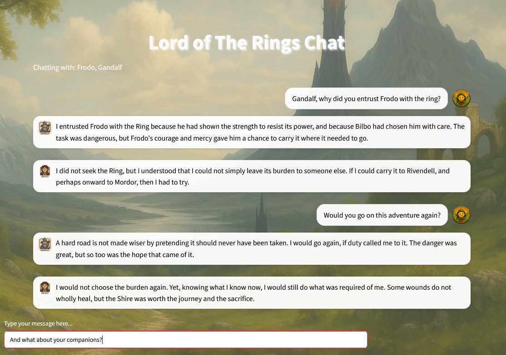
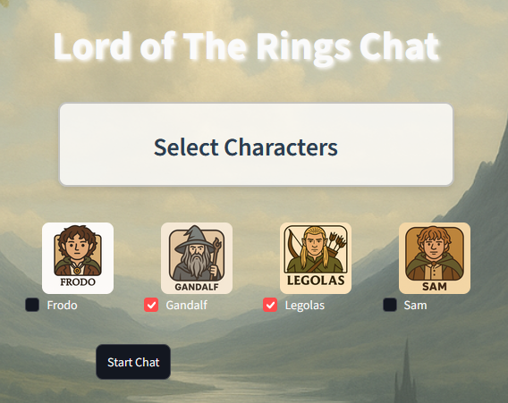

# Lord of the Rings Chatbot

A Streamlit chatbot that lets you chat with Frodo, Gandalf, Legolas, and Sam. It uses Azure OpenAI through AutoGen and retrieves context from Lord of the Rings documents stored in persistent ChromaDB memories.



# Character Selection



## Setup

### 1. Create and activate a virtual environment

```powershell
python -m venv .venv
.\.venv\Scripts\Activate.ps1
```

### 2. Install dependencies

```powershell
pip install -r requirements.txt
```

### 3. Configure Azure OpenAI

Create a `.env` file in the project root:

```env
AZURE_ENDPOINT=https://your-resource.openai.azure.com/
AZURE_OPENAI_KEY=your-azure-openai-key
```

The Azure OpenAI deployment used by the application is `gpt-4o`.

### 4. Start the application

```powershell
streamlit run UI.py
```

Open the local URL shown by Streamlit, select one or two characters, and start a chat. The first conversation creates the local ChromaDB data in `.chromadb_autogen`.

## Project structure

- `UI.py` - Streamlit user interface and chat flow
- `rag_memory.py` - AutoGen agents and vector-memory setup
- `docs_indexer.py` - document loading and indexing
- `Final/` - character and Lord of the Rings source documents
- `prompts/` - character prompt files
- `icons/` and `background.png` - interface assets

## Notes

- The application expects the Azure OpenAI deployment name `gpt-4o`; update `UI.py` if your deployment has a newer version.
